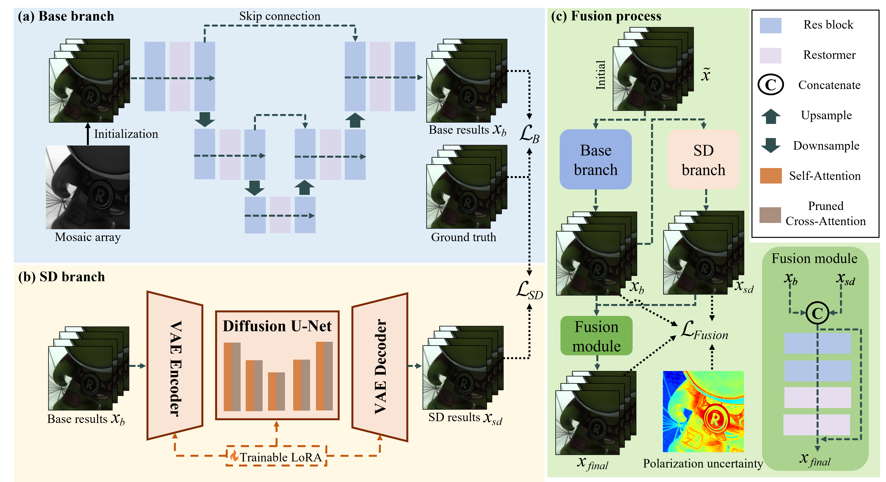

# Polarization Uncertainty-Guided Diffusion Model for Color Polarization Image Demosaicking (AAAI 2026)


:star: If you've found PUGDiff useful for your research or projects, please show your support by starring this repo. Thanks! :hugs: 

---
> Color polarization demosaicking (CPDM) aims to reconstruct full-resolution polarization images of four directions from the color-polarization filter array (CPFA) raw image. Due to the challenge of predicting numerous missing pixels and the scarcity of high-quality training data, existing network-based methods, despite effectively recovering scene intensity information, still exhibit significant errors in reconstructing polarization characteristics (degree of polarization, DOP, and angle of polarization, AOP). To address this problem, we introduce the image diffusion prior from text-to-image (T2I) models to overcome the performance bottleneck of network-based methods, with the additional diffusion prior compensating for limited representational capacity caused by restricted data distribution. To effectively leverage the diffusion prior, we explicitly model the polarization uncertainty during reconstruction and use uncertainty to guide the diffusion model in recovering high error regions. Extensive experiments demonstrate that the proposed method accurately recovers scene polarization characteristics with both high fidelity and strong visual perception.
>
---
## Paper
The paper and SM is stored in [paper](paper/) folder.
## Update
- **2025.12.04**: PUGDiff is released.

## Requirements

```
conda create -n pugdiff python=3.10
conda activate pugdiff
pip install torch==2.4.0 torchvision==0.19.0 torchaudio==2.4.0 --index-url https://download.pytorch.org/whl/cu121
pip install -e ".[torch]"
pip install -r requirements.txt
```


## Inference
### :rocket: Fast testing 
```
python inference_psr.py
```
1. Download the weights from this [link](https://pan.baidu.com/s/1amoKsA8tZoXrqCkXxhbwJg?pwd=3eig), and replace the "weights" folder.

2. All configuration files are stored in the "configs" folder. Modify "sample-sd-turbo.yaml" to achieve the desired processing results.

3. By default, CPFA is synthesized using GT. Store the corresponding angles in "dataroot_gt_{x}". Ensure "dataroot_lq" is consistent with "dataroot_gt" to allow the program to run correctly. 

4. To run on real images, change the "type" to "RealCPDM" and update "dataroot_gt" to the folder where the CPFA data is stored. Alternatively, simply uncomment the lines I have prepared. 

5. "unet.ckpt_path" denotes the path to the base branch weights, and "lora_ckpt_path" denotes the path to the sd branch and fusion module weights.

6. Modify "crop_size" to change the image size, and the location for the final results is determined by "output_path_{x}".


## Training
### :turtle: Preparing stage
1. We use datasets from [EARI](http://www.ok.sc.e.titech.ac.jp/res/PolarDem/index.html), [Qiu's](https://repository.kaust.edu.sa/items/3653d5cd-a78b-40d7-899e-57f5f137ca85) and [PIDSR](https://github.com/PRIS-CV/PIDSR). Download the datasets from this [link](https://pan.baidu.com/s/1LOBak_wWPUNDsEnyfpYE9g?pwd=m8cs), and replace the "datasets" folder.
2. Prepare the config file:
    + SD-Turbo path: configs.sd_pipe.params.cache_dir.
    + Training data path: data.train.params.source{x}.
    + Validation data path: data.val.params.source{x}.
3. The results will be stored in "experiments" folder.

### :dolphin: Begin training
1. Train the base branch.
```
python main.py '--cfg_path' 'configs/stage_for_base.yaml'
```
2. Train the uncertainty network.
```
python main.py '--cfg_path' 'configs/stage_for_un.yaml'
```
Set "unet.ckpt_path" to the path of the best base branch weight.

3. Train the sd branch.
```
python main.py '--cfg_path' 'configs/stage_for_sd.yaml'
```
Set "unet.ckpt_path" to the path of the best base branch weight.

4. Train the fusion module.
```
python main.py '--cfg_path' 'configs/stage_for_fusion.yaml'
```
Set "unet.ckpt_path" to the path of the best base branch weight, "unet.teacher_ckpt_path" to the path of the uncertainty network weight, and "sd_pipe.lora_ckpt_path" to the path of the best sd branch weight.
### :whale: Resume from interruption
Set "resume" and "resume_opt" to "True", and "unet.ckpt_path", "unet.teacher_ckpt_path", "sd_pipe.lora_ckpt_path" to the weight path.


## Acknowledgement

This project is based on [BasicSR](https://github.com/XPixelGroup/BasicSR), [diffusers](https://github.com/huggingface/diffusers), [OSEDiff](https://github.com/cswry/OSEDiff), [InvSR](https://github.com/zsyOAOA/InvSR) and [UDL](https://github.com/QianNing0/UDL). Thanks for their awesome works.

### Contact
If you have any questions, please feel free to contact me via `244603040@csu.edu.cn` or open an issue.
